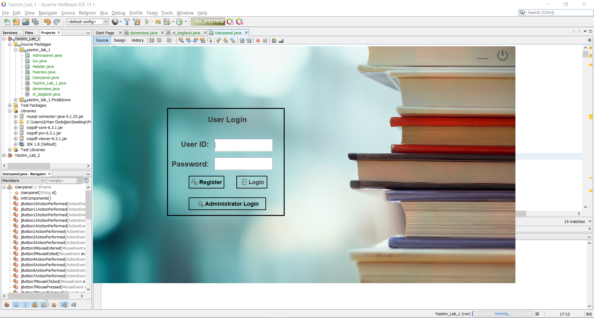
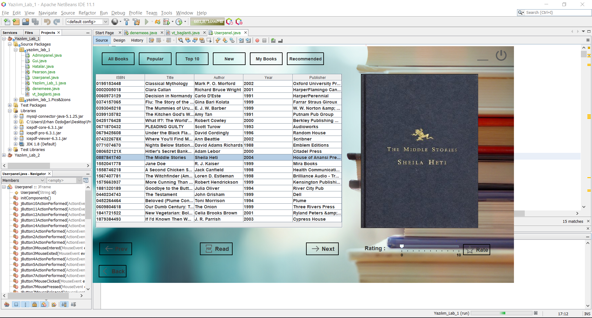
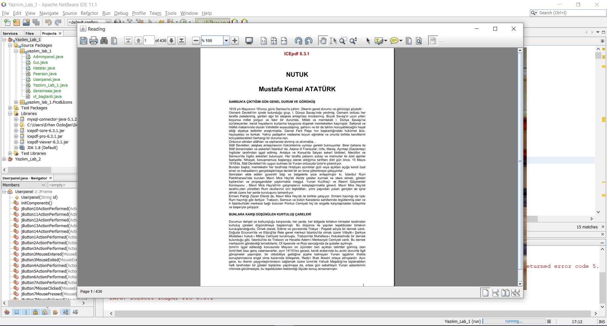

# Book-Reader

### Book reading , rating and recommending with Pearson Correlation 

This project is a book reading and rating application. Users can login or register. They can rate books. Recommending module take a large dataset and recommend books to users according to users's books using pearson correlation. Three large dataset were used In this project. IcePDF 6.3.1 were used for pdf reading 

### Login/Register

### Searching/Rating

### Reading

